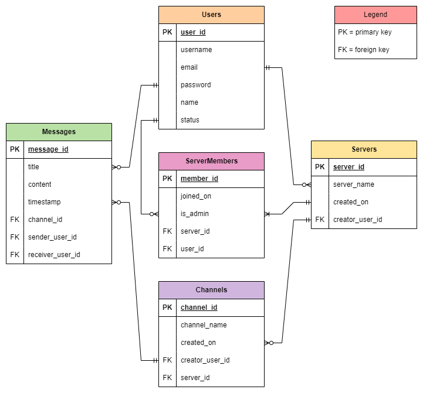

# T2A2 API Webserver

### URL:
- [Trello Board](https://trello.com/b/tMSi0UZC/theresa-t2a2api)  
- [GitHub Repository](https://github.com/theresaxn/Theresa-T2A2_APIWebserver)

## R1: Purpose

There are challenges with commication within online communities due to fragmented communication channels. Since many communities use various messaging platforms, this can lead to difficulty in difficulty tracking discussions and reduced engagement. This Communication API is designed to address this issue by providing a unified platform that facilitates real-communication through channels and direct messaging. Users can create and manage multiple servers and channels that can be dedicated to specific topics or interests.

## R2: Task Allocation & Tracking Progress

I created a Trello board to allocate tasks and track progression. After my draft ERD was approved, I created my cards and added due dates based on priority. The cards were grouped by different stages of the project - Planning, Github, Progres, Main, Models, Schemas, CLI and Controllers (Routes). Since I have three lists - To Do, In Progress and Completed, it was easy to visually see how I was tracking overall in my project since I had to move them as I was working/had completed them.

<details>
<summary>Trello Board Screenshots</summary>

   
   
   
   
   
   
   
   
   
   

</details>

## R3: Third-Party Services, Packages & Dependencies

The third party libraries used in my app includes: 
- flask: A Python web framework that is used in building web applications. Within the app, it is used to handle blueprints, for example: ```auth_bp = Blueprint("auth", __name__, url_prefix="/auth")``` and routing and request and response management, for example: ```@auth_bp.route("/register", methods=["POST"])```  

- psycopg2-binary: A PostgreSQL adapter that is used to connect Python applications to PostgreSQL databases. Within the app, it is used to establish connection with PostgreSQL database - ```app.config["SQLALCHEMY_DATABASE_URI"] = os.environ.get("DATABASE_URL")``` - and handle ```IntegrityError``` error codes that are related to column constraints within the database such as ```NOT_NULL_VIOLATION``` and ```UNIQUE_VIOLATION```  

- flask_sqlalchemy: An extension of Flask that simplifies SQLAlchemy, which is an ORM tool used to help access and manage SQL databases using Python language. Within the app, it is used to define models and manage of database sessions and perform CRUD operations  

- flask_marshmallow: An integration layer for Flask and Marshmallow, which is a tool used for de/serialisation of data (conversion of complex data types such as SQLAlchemy models to and from JSON format). Within the app, it also validates input data such as password complexities and server/channel name length ```server_name = fields.String(validate=Length(min=5, error="must be at least 5 characters long"))```  

- marshmallow_sqlalchemy: An extension of Marshmallow that adds support to the de/serialisation of SQLAlchemy models  

- flask_bcrypt: An extension of Flask that provides brcypt hashing, essential for authentication. Within the app, it is used for hashing passwords ```user.password = bcrypt.generate_password_hash(password).decode("utf-8")``` and checking password hashes against plain-text passwords ```bcrypt.check_password_hash(user.password, body_data.get("password")```  

- flask_jwt_extended: An extension of Flask that handles authentication and authorisation using a JWT tokens. Within the app, JWT tokens are created by ```create_access_token``` and set to expire within a day using ```expires_delta```. Users are then authenicated using the ```jwt_required``` decorator

## R4: Benefits & Drawbacks of PostgreSQL

My app uses PostgreSQL, which is an open source object relational database system. It is known for its reliability and robustness and has the ability to manage large amounts of data and handle more advanced or complex queries efficiently.

Benefits of PostgreSQL:
- It is an open source database, meaning it is free to use and is an affordable solution as there is no licensing fee
- It is very reliable and maintains data integrity. Being ACID compliant, it helps preserve data consistency and avoids errors in data
- It is highly extensive and supports multiple data types and procedural language, including user custom ones, making it adaptable
- It has strong community support, providing various channels such as forums to turn to for resources and seek assistance in writing and checking errors in code

Drawbacks of PostgreSQL:
- It has a steep learning curve so it can be challenging for beginners to optimally use it, compared to simpler databases
- It can have slower performance when querying data as it begins from the first row and will read through the entirety of the table to locate relevant data. This means the more data that is stored within the table, the greater performance may be impacted
- It can be resource intensive and can have high memory consumption due to its advanced features

## R5: SQLAlchemy - Object-Relational Mapping (ORM)

My app uses SQLAlchemy as the ORM system. It allows interaction with SQL databases using high-level programming languages such as Python. Some key features include:

#### Declarative Mapping 

SQLAlchemy simplifies model creation by merging table definitions and model classes into a single entity. In the below example code, the ```Channel``` class corresponds to a database table, defined by the ```db.Model```. The variables corresponds to the attributes in the table. In the example, ```channel_name``` would represent the column name, ```db.String``` would represent the data type and ```nullable=False``` would represent the constraint.

```
class Channel(db.Model):
    __tablename__ = "channels"
    channel_id = db.Column(db.Integer, primary_key=True)
    channel_name = db.Column(db.String, nullable=False)
    created_on = db.Column(db.Date)
    creator_user_id = db.Column(db.Integer, db.ForeignKey("users.user_id"), nullable=False)
    user = db.relationship("User", back_populates ="channels")
    server_id = db.Column(db.Integer, db.ForeignKey("servers.server_id"), nullable=False)
    server = db.relationship("Server", back_populates="channels")
    messages = db.relationship("Message", back_populates="channel", cascade="all, delete")
```

#### Foreign Keys & Relationships

SQLAlchemy can help establish the relationships between tables, including one-to-one and one-to-many associations. The foreign keys are defined by ```db.ForeignKey``` followed by the table and column name ```("users.user_id")``` and the relationships are defined by ```db.relationship```. The relationship ensures data integrity is maintained. In the below example snippet of code, ```creator_user_id``` is a foreign key that links the user_id column on my users table.

```
    creator_user_id = db.Column(db.Integer, db.ForeignKey("users.user_id"), nullable=False)
    user = db.relationship("User", back_populates ="channels")
```

#### Session Management / CRUD Operations

SQLAlchemy manages transactions using the ```session``` object and simplifies the process when handling CRUD operations. In the below example code, the transaction of deleting a message involves searching querying the database to find the ```message_id```. If it exists, ```db.session.delete(message)``` is used to delete the message and ```db.session.commit()``` is used to commit the changes in the database.

```
@message_bp.route("/delete/<int:message_id>", methods=["DELETE"])
@jwt_required()
@message_exist("message_id")
def delete_message(message_id):
    message = Message.query.get(message_id)
    db.session.delete(message)
    db.session.commit()
    return {"message": f"message with id {message_id} has been deleted"}
```

#### Querying 

SQLAlchemy provides an easy query method in order to retreive and manipulate data in the database. In the below example, ```Channel.query.get(channel_id)``` will locate a channel in the database based on the ```channel_id``` provided.

```
@channel_bp.route("/update/<int:channel_id>", methods=["PUT", "PATCH"])
@jwt_required()
@channel_exist("server_id", "channel_id")
@current_member("server_id")
@auth_as_admin("server_id")
def update_channel(server_id, channel_id):
    body_data = channel_schema.load(request.get_json())
    channel = Channel.query.get(channel_id)
    channel.channel_name = body_data.get("channel_name") or channel.channel_name
    db.session.commit()
    return channel_schema.dump(channel)
```

## R6: ERD

   

### Relationships  

One-to-many:
- User to servers
- User to server members
- User to channels
- User to messages
- Channel to messages
- Server to server members

Many-to-many:
- Servers to channels via users table
- Users to servers via server members table

### Normalisation

All entities in the ERD are in 3NF - they all contain atomic columns, there are no transitive dependencies and all non-key attributes are fully functionally dependent on the primary key

## R7: Implemented Models & Relationships

### Users Model

Table: ```users```

Columns:
- ```user_id```: Integer, primary key
- ```username```: String, unique, not null
- ```email```: String, unique, not null
- ```password```: String, unique, not null, must meet regexp conditions
- ```name```: String
- ```status```: String, default to offline

Relationships:

One-to-many
- ```user``` to ```servers``` 
- ```user``` to ```server_members```
- ```user``` to ```channels```
- ```user``` to ```messages_sender```
- ```user``` to ```messages_receiver```

<details>
<summary>Full Model Code</summary>

```
class User(db.Model):
    __tablename__ = "users"

    user_id = db.Column(db.Integer, primary_key=True)
    username = db.Column(db.String, nullable=False, unique=True)
    email = db.Column(db.String, nullable=False, unique=True)
    password = db.Column(db.String, nullable=False)
    name = db.Column(db.String)
    status = db.Column(db.String, default="offline")

    servers = db.relationship("Server", back_populates="user", cascade="all, delete")
    server_members = db.relationship("ServerMember", back_populates="user", cascade="all, delete")
    channels = db.relationship("Channel", back_populates="user", cascade="all, delete")
    
    messages_sender = db.relationship("Message",
                                      foreign_keys="[Message.sender_user_id]",
                                      back_populates="sender_user",
                                      cascade="all, delete")
    messages_receiver = db.relationship("Message",
                                        foreign_keys="[Message.receiver_user_id]",
                                        back_populates="receiver_user",
                                        cascade="all, delete")
```

</details>

Example Queries:

From ```user = User.query.get(user_id)```:

- Get all servers created by user
    ```
    servers = user.servers
    ```
- Get all channels created by user
    ```
    channels = user.channels
    ```
- Get all messages sent by user
    ```
    sent_messages = user.messages_sender
    ```
- Get all messages received by user
    ```
    received_messages = user.messages_receiver
    ```

### Servers Model

Table: ```servers```

Columns:
- ```server_id```: Integer, primary key
- ```server_name```: String, min length=5, not null
- ```created_on```: Date

Relationships:

One-to-many
- ```server``` to ```server_members```
- ```server``` to ```channels```

Many-to-one
- ```servers``` to ```user```

<details>
<summary>Full Model Code</summary>

```
class Server(db.Model):
    __tablename__ = "servers"

    server_id = db.Column(db.Integer, primary_key=True)
    server_name = db.Column(db.String, nullable=False)
    created_on = db.Column(db.Date)

    creator_user_id = db.Column(db.Integer, db.ForeignKey("users.user_id"), nullable=False)
    user = db.relationship("User", back_populates="servers")

    server_members = db.relationship("ServerMember", back_populates="server", cascade="all, delete")
    channels = db.relationship("Channel", back_populates="server", cascade="all, delete")
```

</details>

Example Queries:

From ```server = Server.query.get(server_id)```:

- Get all channels in a server
    ```
    channels_in_server = server.channels
    ```

### Server Members Model

Table: ```server_members```

Columns:
- ```member_id```: Integer, primary key
- ```joined_on```: Date,
- ```is_admin```: Boolean, default to False

Relationships:

Many-to-one
- ```server_members``` to ```server```
- ```server_members``` to ```user```

<details>
<summary>Full Model Code</summary>

```
class ServerMember(db.Model):
    __tablename__ = "server_members"

    member_id = db.Column(db.Integer, primary_key=True)
    joined_on = db.Column(db.Date)
    is_admin = db.Column(db.Boolean, default=False)
    
    server_id = db.Column(db.Integer, db.ForeignKey("servers.server_id"), nullable=False)
    server = db.relationship("Server", back_populates="server_members")

    user_id = db.Column(db.Integer, db.ForeignKey("users.user_id"), nullable=False)
    user = db.relationship("User", back_populates="server_members")
```

</details>

### Channels Model

Table: ```channels```

Columns:
- ```channel_id```: Integer, primary key
- ```channel_name```: String, min length=5, not null
- ```created_on```: Date

Relationships:

One-to-many
- ```channel``` to ```messages```

Many-to-one
- ```channels``` to ```user```
- ```channels``` to ```server```

<details>
<summary>Full Model Code</summary>

```
class Channel(db.Model):
    __tablename__ = "channels"

    channel_id = db.Column(db.Integer, primary_key=True)
    channel_name = db.Column(db.String, nullable=False)
    created_on = db.Column(db.Date)

    creator_user_id = db.Column(db.Integer, db.ForeignKey("users.user_id"), nullable=False)
    user = db.relationship("User", back_populates ="channels")

    server_id = db.Column(db.Integer, db.ForeignKey("servers.server_id"), nullable=False)
    server = db.relationship("Server", back_populates="channels")

    messages = db.relationship("Message", back_populates="channel", cascade="all, delete")
```

</details>

Example Queries:

From ```channel = Channel.query.get(channel_id)```:

- Get all messages in a channel
    ```
    messages_in_channel = server.channels
    ```

### Messages Model

Table: ```messages```

Columns:
- ```message_id```: Integer, primary key
- ```title```: String
- ```content```: String, not null
- ```created_on```: Datetime

Relationships:

Many-to-one
- ```messages``` to ```channel```
- ```messages_sender``` to ```sender_user```
- ```messages_receiver``` to ```receiver_user```

<details>
<summary>Full Model Code</summary>

```
class Message(db.Model):
    __tablename__ = "messages"

    message_id = db.Column(db.Integer, primary_key=True)
    title = db.Column(db.String, nullable=True)
    content = db.Column(db.String, nullable=False)
    timestamp = db.Column(db.DateTime)
    
    channel_id = db.Column(db.Integer, db.ForeignKey("channels.channel_id"), nullable=True)
    channel = db.relationship("Channel", back_populates="messages")

    sender_user_id = db.Column(db.Integer, db.ForeignKey("users.user_id"), nullable=False)
    sender_user = db.relationship("User",
                                  foreign_keys=[sender_user_id],
                                  back_populates="messages_sender")

    receiver_user_id = db.Column(db.Integer, db.ForeignKey("users.user_id"), nullable=True)
    receiver_user = db.relationship("User",
                                    foreign_keys=[receiver_user_id],
                                    back_populates="messages_receiver")
```

</details>

## R8: API Endpoints

*** All routes begin with ```http://127.0.0.1:8080``` ***

### User Endpoints: 

#### Register User
- HTTP Verb: ```POST```
- Route: ```/auth/register```
- Required Data:  
    Header: ```None```  
    Body:  
    - ```username```: String, must be unique
    - ```email```: String, must be unique 
    - ```name```: String
    - ```password```: String, must meet regexp conditions
        ```
        {
            "username": "user3",
            "email": "user3@email.com",
            "name": "user 3",
            "password": "123456Aa!"
        }
        ```
- Response:
    - If successful (201 CREATED):
        ```
        {
            "user_id": 3,
            "username": "user3",
            "email": "user3@email.com",
            "name": "user 3",
            "status": "offline",
            "servers": []
        }
        ```
    - If error:   
        - Username/Email - Not Unique (409 CONFLICT):
            ```
            {
                "error": "[column_name] already in use"
            }
            ```
        - Password Requirements Unmet (400 BAD REQUEST)
            ```
            {
                "error": {
                    "password": [
                        "needs to be minimum eight characters, at least one uppercase letter, one lowercase letter, one number and one special character"
                    ]
                }
            }
            ```
        - Missing Required Fields (409 CONFLICT):
            ```
            {
                "error": "[column_name] is required"
            }
            ```

#### Login User
- HTTP Verb: ```POST```
- Route: ```/auth/login```
- Required Data:  
    Header: ```None```  
    Body:  
    - ```email```: String
    - ```password```: String
        ```
        {
            "email": "user3@email.com",
            "password": "123456Aa!"
        }
        ```
- Response:
    - If successful (200 OK):
        ```
        {
            "message": "welcome back user3",
            "token": "[JWT_ACCESS_TOKEN]"
        }
        ```
    - If unsuccessful (409 CONFLICT):   
        - Username/Email - Not Unique (409 CONFLICT):
            ```
            {
                "error": "invalid login details"
            }
            ```

#### Update User
- HTTP Verb: ```PUT``` or ```PATCH```
- Route: ```/user/updateaccount```
- Required Data:  
    Header: ```Bearer [JWT_TOKEN]```  
    Body:  
    - ```username```: String, must be unique (optional)
    - ```password```: String, must meet regexp conditions (optional)
    - ```name```: String (optional)
    - ```status```: String, must meet validation requirements (optional)
        ```
        {
            "name": "updated user 3",
            "status": "away",
            "username": "username3",
            "password": "new_123456Aa!"
        }
        ```
- Response:
    - If successful (200 OK):
        ```
        {
            "user_id": 3,
            "username": "username3",
            "email": "user3@email.com",
            "name": "updated user 3",
            "status": "away",
            "servers": []
        }
        ```
    - If error:  
        - Status Validation Requirments Unmet (409 CONFLICT)
            ```
            {
                "error": {
                    "status": [
                        "must be one of: online, offline, away"
                    ]
                }
            }
            ```
        - Password Requirements Unmet (400 BAD REQUEST)
            ```
            {
                "error": {
                    "password": [
                        "needs to be minimum eight characters, at least one uppercase letter, one lowercase letter, one number and one special character"
                    ]
                }
            }
            ```

#### Delete User
- HTTP Verb: ```DELETE```
- Route: ```/user/deleteaccount```
- Required Data:  
    Header: ```Bearer [JWT_TOKEN]```  
    Body: ```None```  
- Response:
    - If successful (200 OK):
        ```
        {
            "message": "user username3 has been deleted"
        }
        ```

### Server Endpoints: 

#### View All Servers (From User)
- HTTP Verb: ```GET```
- Route: ```/server/all/user/<int:user_id>```
- Required Data:  
    Header: ```Bearer [JWT_TOKEN]```  
    Body: ```None``` 
- Response:
    - If successful (200 OK):
        ```
        [
            {
                "server_id": 4,
                "server_name": "new server",
                "created_on": "2024-07-28",
                "user": [...],
                "server_members": [...],
                "channels": []
            },
            {
                "server_id": 5,
                "server_name": "newer server",
                "created_on": "2024-07-28",
                "user": [...],
                "server_members": [...],
                "channels": []
            }
        ]
        ```
    - If error:  
        - User Not Found (404 NOT FOUND)
            ```
            {
                "error": "user with id 4 not found"
            }
            ```

#### View Server
- HTTP Verb: ```GET```
- Route: ```/server/<int:server_id>```
- Required Data:  
    Header: ```Bearer [JWT_TOKEN]```  
    Body: ```None``` 
- Response:
    - If successful (200 OK):
        ```
        {
            "server_id": 1,
            "server_name": "server 1",
            "created_on": "2024-07-28",
            "user": [...],
            "server_members": [...],
            "channels": [...]
        }
        ```
    - If error:  
        - Server Not Found (404 NOT FOUND)
            ```
            {
                "error": "server with id 10 not found"
            }
            ```

#### Create Server
- HTTP Verb: ```POST```
- Route: ```/server/create```
- Required Data:  
    Header: ```Bearer [JWT_TOKEN]```  
    Body:
    - ```server_name```: String, must be at least 5 characters  
        ```
        {
            "server_name": "new server"
        }
        ```
- Response:
    - If successful (201 CREATED):
        ```
        {
            "server_id": 4,
            "server_name": "new server",
            "created_on": "2024-07-28",
            "user": [...],
            "server_members": [...],
            "channels": []
        }
        ```
    - If error:  
        - Server Name Validation Requirments Unmet (409 CONFLICT)
            ```
            {
                "error": {
                    "status": [
                        "must be one of: online, offline, away"
                    ]
                }
            }
            ```

#### Update Server
- HTTP Verb: ```PUT``` or ```PATCH```
- Route: ```/server/update/<int:server_id>```
- Required Data:  
    Header: ```Bearer [JWT_TOKEN]```  
    Body:
    - ```server_name```: String, must be at least 5 characters (optional)
        ```
        {
            "server_name": "newname abcd"
        }
        ```
- Response:
    - If successful (200 OK):
        ```
        {
            "server_id": 6,
            "server_name": "newname abcd",
            "created_on": "2024-07-28",
            "user": [...],
            "server_members": [...],
            "channels": []
        }
        ```
    - If error: 
        - Server Not Found (404 NOT FOUND)
            ```
            {
                "error": "server with id 10 not found"
            }
            ```
        - Server Does Not Belong To User, Not Authorised (403 FORBIDDEN)
            ```
            {
                "error": "user not authorised to perform action"
            }
            ```
        - Server Name Validation Requirments Unmet (409 CONFLICT)

#### Delete Server
- HTTP Verb: ```DELETE```
- Route: ```/server/delete/<int:server_id>```
- Required Data:  
    Header: ```Bearer [JWT_TOKEN]```  
    Body: ```None``` 
- Response:
    - If successful (200 OK):
        ```
        {
            "message": "server newer server has been deleted"
        }
        ```
    - If error:
        - Server Not Found (404 NOT FOUND)
            ```
            {
                "error": "server with id 10 not found"
            }
            ```
        - Server Does Not Belong To User, Not Authorised (403 FORBIDDEN)  
            ```
            {
                "error": "user not authorised to perform action"
            }
            ```

### Server Member Endpoints: 

#### View All Server Members (From Server)
- HTTP Verb: ```GET```
- Route: ```/server/<int:server_id>/member/all```
- Required Data:  
    Header: ```Bearer [JWT_TOKEN]```  
    Body: ```None``` 
- Response:
    - If successful (200 OK):
        ```
        [
            {
                "member_id": 1,
                "joined_on": "2024-07-28",
                "is_admin": true,
                "server": [...],
                "user": [...]
            },
            {
                "member_id": 2,
                "joined_on": "2024-07-28",
                "is_admin": false,
                "server": [...],
                "user": [...]
            }
        ]
        ```
    - If error:
        - Server Not Found (404 NOT FOUND)
            ```
            {
                "error": "server with id 10 not found"
            }
            ```
        - User Not A Member In Server (400 BAD REQUEST)  
            ```
            {
                "error": "user not a member of server server 1"
            }
            ```

#### View Server Member (From Server)
- HTTP Verb: ```GET```
- Route: ```/server/<int:server_id>/member/<int:member_id>```
- Required Data:  
    Header: ```Bearer [JWT_TOKEN]```  
    Body: ```None``` 
- Response:
    - If successful (200 OK):
        ```
        {
            "member_id": 4,
            "joined_on": "2024-07-28",
            "is_admin": true,
            "server": [...],
            "user": [...]
        }
        ```
    - If error:
        - Server Not Found (404 NOT FOUND)
            ```
            {
                "error": "server with id 10 not found"
            }
            ```
        - User Not A Member In Server (400 BAD REQUEST)  
            ```
            {
                "error": "user not a member of server server 1"
            }
            ```
        - Member Does Not Belong To Server (404 NOT FOUND)
            ```
            {
                "error": "member with id 3 not found in server server a"
            }
            ```

#### Join As Server Member
- HTTP Verb: ```POST```
- Route: ```/server/<int:server_id>/member/join```
- Required Data:  
    Header: ```Bearer [JWT_TOKEN]```  
    Body: ```None``` 
- Response:
    - If successful (201 CREATED):
        ```
        {
            "member_id": 9,
            "joined_on": "2024-07-28",
            "is_admin": false,
            "server": [...],
            "user": [...]
        }
        ```
    - If error:  
        - User Already Member (400 BAD REQUEST)
            ```
            {
                "error": "user is already a member of server server 2"
            }
            ```
#### Add User As Server Member
- HTTP Verb: ```POST```
- Route: ```/server/<int:server_id>/member/join```
- Required Data:  
    Header: ```Bearer [JWT_TOKEN]```  
    Body: ```None``` 
- Response:
    - If successful (201 CREATED):
        ```
        {
            "member_id": 10,
            "joined_on": "2024-07-28",
            "is_admin": false,
            "server": [...],
            "user": [...]
        }
        ```
    - If error:  
        - User (Being Added) Already Member (400 BAD REQUEST)
            ```
            {
                "error": "user is already a member of server server 2"
            }
            ```
        - User (Adding) Not A Member In Server (400 BAD REQUEST)
            ```
            {
                "error": "user not a member of server server 1"
            }
            ```
        - User (Adding) Not Authorised (403 FORBIDDEN)  
            ```
            {
                "error": "user not authorised to perform action"
            }
            ```
#### Update Server Member
- HTTP Verb: ```PUT``` or ```PATCH```
- Route: ```/server/<int:server_id>/member/update/<int:member_id>```
- Required Data:  
    Header: ```Bearer [JWT_TOKEN]```  
    Body:
    - ```is_admin```: Boolean (optional)
         ```
        {
            "is_admin": true
        }
        ```
- Response:
    - If successful (200 OK):
        ```
        {
            "member_id": 10,
            "joined_on": "2024-07-28",
            "is_admin": true,
            "server": [...],
            "user": [...]
        }
        ```
    - If error:  
        - User Not A Member In Server (400 BAD REQUEST)
            ```
            {
                "error": "user not a member of server server 1"
            }
            ```
        - User Not Authorised (403 FORBIDDEN)
            ```
            {
                "error": "user not authorised to perform action"
            }
            ```
        - Member Not Found (404 NOT FOUND) 
            ```
            {
                "error": "member with id 11 not found"
            }
            ```
        - Member Not Found In Server (404 NOT FOUND)
            ```
            {
                "error": "member with id 1 not found in server new server"
            }
            ```
        - User (To Update) Is Server Creator (400 BAD REQUEST)
            ```
            {
            "error": "user user1 cannot be updated or deleted"
            }
            ```
#### Delete Server Member
- HTTP Verb: ```DELETE```
- Route: ```/server/<int:server_id>/member/delete/<int:member_id>```
- Required Data:  
    Header: ```Bearer [JWT_TOKEN]```  
    Body: ```None```
- Response:
    - If successful (201 CREATED):
        ```
        {
            "message": "member has been deleted from server server ABC"
        }
        ```
    - If error:  
        - User Not A Member In Server (400 BAD REQUEST)
            ```
            {
                "error": "user not a member of server server 1"
            }
            ```
        - User Not Authorised (403 FORBIDDEN)\
            ```
            {
                "error": "user not authorised to perform action"
            }
            ```
        - Member Not Found (404 NOT FOUND) 
            ```
            {
                "error": "member with id 11 not found"
            }
            ```
        - Member Not Found In Server (404 NOT FOUND)
            ```
            {
                "error": "member with id 1 not found in server new server"
            }
        - User (To Update) Is Server Creator (400 BAD REQUEST)
            ```
            {
            "error": "user user1 cannot be updated or deleted"
            }
            ```
### Channel Endpoints: 

#### View All Channels (In Server)
- HTTP Verb: ```GET```
- Route: ```/server/<int:server_id>/channel/all```
- Required Data:  
    Header: ```Bearer [JWT_TOKEN]```  
    Body: ```None``` 
- Response:
    - If successful (200 OK):
        ```
        [
            {
                "channel_id": 2,
                "channel_name": "channel 2",
                "created_on": "2024-07-28",
                "user": [...],
                "server": [...],
                "messages": []
            },
            {
                "channel_id": 4,
                "channel_name": "channel abcde",
                "created_on": "2024-07-28",
                "user": [...],
                "server": [...],
                "messages": []
            }
        ]
        ```
    - If error:
        - Server Not Found (404 NOT FOUND)
            ```
            {
                "error": "server with id 10 not found"
            }
            ```
        - User Not A Member In Server (400 BAD REQUEST)  
            ```
            {
                "error": "user not a member of server server 1"
            }
            ```

#### View Channel
- HTTP Verb: ```GET```
- Route: ```/server/<int:server_id>/channel/<int:channel_id>```
- Required Data:  
    Header: ```Bearer [JWT_TOKEN]```  
    Body: ```None``` 
- Response:
    - If successful (200 OK):
        ```
        {
            "channel_id": 2,
            "channel_name": "channel 2",
            "created_on": "2024-07-28",
            "user": [...],
            "server": [...],
            "messages": []
        }
        ```
    - If error:
        - Server Not Found (404 NOT FOUND)
            ```
            {
                "error": "server with id 10 not found"
            }
            ```
        - User Not A Member In Server (400 BAD REQUEST) 
            ```
            {
                "error": "user not a member of server server 1"
            }
            ```
        - Channel Not Found (404 NOT FOUND)
            ```
            {
                "error": "channel with id 20 not found"
            }
            ```
        - Channel Not Found In Server (404 NOT FOUND)
            ```
            {
                "error": "channel with id 2 not found in server server a"
            }
            ```

#### Add Channel
- HTTP Verb: ```POST```
- Route: ```/server/<int:server_id>/channel/create```
- Required Data:  
    Header: ```Bearer [JWT_TOKEN]```  
    Body:
    - ```channel_name```: String, must be at least 5 characters 
        ```
        {
            "channel_name": "new abcde"
        }
        ```
- Response:
    - If successful (201 CREATED):
        ```
        {
            "channel_id": 5,
            "channel_name": "new abcde",
            "created_on": "2024-07-28",
            "user": [...],
            "server": [...],
            "messages": []
        }
        ```
    - If error:  
        - Server Not Found (404 NOT FOUND)
            ```
            {
                "error": "server with id 10 not found"
            }
            ```
        - User Not A Member In Server (400 BAD REQUEST)
            ```
            {
                "error": "user not a member of server server 1"
            }
            ```
        - User Not Authorised (403 FORBIDDEN)
            ```
            {
                "error": "user not authorised to perform action"
            }
            ```

#### Update Channel
- HTTP Verb: ```PUT``` or ```PATCH```
- Route: ```/server/<int:server_id>/channel/update/<int:channel_id>```
- Required Data:  
    Header: ```Bearer [JWT_TOKEN]```  
    Body:
    - ```channel_name```: String, must be at least 5 characters (optional)
        ```
        {
            "channel_name": "new 123456"
        }
        ```
- Response:
    - If successful (200 OK):
        ```
        {
            "channel_id": 5,
            "channel_name": "new 123456",
            "created_on": "2024-07-28",
            "user": [...],
            "server": [...],
            "messages": []
        }
                ```
    - If error:  
        - Server Not Found (404 NOT FOUND)
            ```
            {
                "error": "server with id 10 not found"
            }
            ```
        - User Not A Member In Server (400 BAD REQUEST)
            ```
            {
                "error": "user not a member of server server 1"
            }
            ```
        - User Not Authorised (403 FORBIDDEN)\
            ```
            {
                "error": "user not authorised to perform action"
            }
            ```
        - Channel Not Found (404 NOT FOUND)
            ```
            {
                "error": "channel with id 20 not found"
            }
            ```
        - Channel Not Found In Server (404 NOT FOUND)
            ```
            {
                "error": "channel with id 2 not found in server server a"
            }
            ```

#### Delete Channel
- HTTP Verb: ```DELETE```
- Route: ```/server/<int:server_id>/channel/delete/<int:channel_id>```
- Required Data:  
    Header: ```Bearer [JWT_TOKEN]```  
    Body: ```None```
- Response:
    - If successful (201 CREATED):
        ```
        {
            "message": "channel new 123456 has been deleted from server server 2"
        }
        ```
    - If error:  
        - Server Not Found (404 NOT FOUND)
            ```
            {
                "error": "server with id 10 not found"
            }
            ```
        - User Not A Member In Server (400 BAD REQUEST)
            ```
            {
                "error": "user not a member of server server 1"
            }
            ```
        - User Not Authorised (403 FORBIDDEN)
            ```
            {
                "error": "user not authorised to perform action"
            }
            ```
        - Channel Not Found (404 NOT FOUND)
            ```
            {
                "error": "channel with id 20 not found"
            }
            ```
        - Channel Not Found In Server (404 NOT FOUND)
            ```
            {
                "error": "channel with id 2 not found in server server a"
            }
            ```

### Message Endpoints: 

#### View All Direct Messages Received
- HTTP Verb: ```GET```
- Route: ```/user/message/all```
- Required Data:  
    Header: ```Bearer [JWT_TOKEN]```  
    Body: ```None``` 
- Response:
    - If successful (200 OK):
        ```
        [
            {
                "message_id": 3,
                "title": null,
                "content": "message content",
                "timestamp": "2024-07-28T12:11:20",
                "channel": null,
                "sender_user": [...],
                "receiver_user": [...]
            },
            {
                "message_id": 1,
                "title": null,
                "content": "message 1",
                "timestamp": "2024-07-28T11:09:33",
                "channel": null,
                "sender_user": [...],
                "receiver_user": [...]
            }
        ]
        ```

#### View All Messages (In Channel)
- HTTP Verb: ```GET```
- Route: ```/channel/<int:channel_id>/message/all```
- Required Data:  
    Header: ```Bearer [JWT_TOKEN]```  
    Body: ```None``` 
- Response:
    - If successful (200 OK):
        ```
        [
            {
                "message_id": 9,
                "title": "title",
                "content": "message content",
                "timestamp": "2024-07-28T12:15:00",
                "channel": [...],
                "sender_user": [...],
                "receiver_user": null
            },
            {
                "message_id": 8,
                "title": "title",
                "content": "message content",
                "timestamp": "2024-07-28T12:15:02",
                "channel": [...],
                "sender_user": [...],
                "receiver_user": null
            }
        ]
        ```
    - If error:
        - User Not A Member In Server (400 BAD REQUEST)  
            ```
            {
                "error": "user not a member of server server 1"
            }
            ```
        - Channel Not Found (404 NOT FOUND)
            ```
            {
                "error": "channel with id 20 not found"
            }
            ```
        - Channel Not Found In Server (404 NOT FOUND)
            ```
            {
                "error": "channel with id 2 not found in server server a"
            }
            ```

#### View Message (In Channel)
- HTTP Verb: ```GET```
- Route: ```/channel/<int:channel_id>/message/<int:message_id>```
- Required Data:  
    Header: ```Bearer [JWT_TOKEN]```  
    Body: ```None``` 
- Response:
    - If successful (200 OK):
        ```
        {
            "message_id": 9,
            "title": "title",
            "content": "message content",
            "timestamp": "2024-07-28T12:15:02",
            "channel": [...],
            "sender_user": [...],
            "receiver_user": null
        }
        ```
    - If error:
        - User Not A Member In Server (400 BAD REQUEST)  
            ```
            {
                "error": "user not a member of server server 1"
            }
            ```
        - Channel Not Found (404 NOT FOUND)
            ```
            {
                "error": "channel with id 20 not found"
            }
            ```
        - Channel Not Found In Server (404 NOT FOUND)
            ```
            {
                "error": "channel with id 2 not found in server server a"
            }
            ```
        - Message Not Found (404 NOT FOUND)
            ```
            {
                "error": "message with id 70 not found"
            }
            ```
        - Message Not Found In Channel (404 NOT FOUND)
            ```
            {
                "error": "message with id 7 not found in channel channel 2"
            }
            ```

#### Send Direct Message
- HTTP Verb: ```POST```
- Route: ```/user/message/send/<int:user_id>```
- Required Data:  
    Header: ```Bearer [JWT_TOKEN]```  
    Body:
    - ```content```: String
        ```
        {
            "content": "message content abc"
        }
        ```
- Response:
    - If successful (201 CREATED):
        ```
        {
            "message_id": 12,
            "title": null,
            "content": "message content abc",
            "timestamp": "2024-07-28T12:22:42",
            "channel": null,
            "sender_user": [...],
            "receiver_user": [...]
        }
        ```
    - If error:  
        - User (Receiver) Not Found (404 NOT FOUND)

#### Post Channel Message
- HTTP Verb: ```POST```
- Route: ```/channel/<int:channel_id>/message/post```
- Required Data:  
    Header: ```Bearer [JWT_TOKEN]```  
    Body:
    - ```title```: String (optional)
    - ```content```: String
        ```
        {
            "title": "new title",
            "content": "new message"
        }
        ```
- Response:
    - If successful (201 CREATED):
        ```
        {
            "message_id": 13,
            "title": "new title",
            "content": "new message",
            "timestamp": "2024-07-28T12:24:24",
            "channel": [...],
            "sender_user": [...],
            "receiver_user": null
        }
        ```
    - If error:  
        - User Not A Member In Server (400 BAD REQUEST)  
            ```
            {
                "error": "user not a member of server server 1"
            }
            ```
        - Channel Not Found (404 NOT FOUND)
            ```
            {
                "error": "channel with id 20 not found"
            }
            ```
        - Channel Not Found In Server (404 NOT FOUND)
            ```
            {
                "error": "channel with id 2 not found in server server a"
            }
            ```

#### Update Message Sent
- HTTP Verb: ```PUT``` or ```PATCH```
- Route: ```/message/update/<int:message_id>```
- Required Data:  
    Header: ```Bearer [JWT_TOKEN]```  
    Body:
    - ```title```: String (optional)
    - ```content```: String
        ```
        {
            "title": "title - updated",
            "content": "updated msg"
        }
        ```
- Response:
    - If successful (200 OK):
        ```
        {
            "message_id": 13,
            "title": "title - updated",
            "content": "updated msg",
            "timestamp": "2024-07-28T12:26:59",
            "channel": [...],
            "sender_user": [...],
            "receiver_user": null
        }
        ```
    - If error:  
        - Message Not Found (404 NOT FOUND)
            ```
            {
                "error": "message with id 2 not found"
            }
            ```
        - Message Does Not Belong To User, Not Authorised (403 FORBIDDEN)
            ```
            {
                "error": "message with id 12 does not belong to user"
            }
            ```

#### Delete Message Sent
- HTTP Verb: ```DELETE```
- Route: ```/message/delete/<int:message_id>```
- Required Data:  
    Header: ```Bearer [JWT_TOKEN]```  
    Body: ```None```
- Response:
    - If successful (200 OK):
        ```
        {
            "message": "message with id 13 has been deleted"
        }
        ```
    - If error:  
        - Message Not Found (404 NOT FOUND)
            ```
            {
                "error": "message with id 2 not found"
            }
            ```
        - Message Does Not Belong To User, Not Authorised (403 FORBIDDEN)
            ```
            {
                "error": "message with id 12 does not belong to user"
            }
            ```

## Code Style Guide
My application adheres to the [Google Python Style Guide](https://google.github.io/styleguide/pyguide.html).

Some of the styling guides that I have implemented in my code includes:
- Use import statements for packages and modules only, not for individual types, classes, or functions
- Import each module using the full pathname location of the module
- Imports should be on separate lines 
- Exceptions - Never use catch-all except: statements, or catch Exception or StandardError
- True/False Evaluations - Use the “implicit” false if at all possible
- Lexical scoping
- Maximum line length is 80 characters
- Use parentheses sparingly
- Whitespace standard rules
- Use a f-string when appropriate

        


